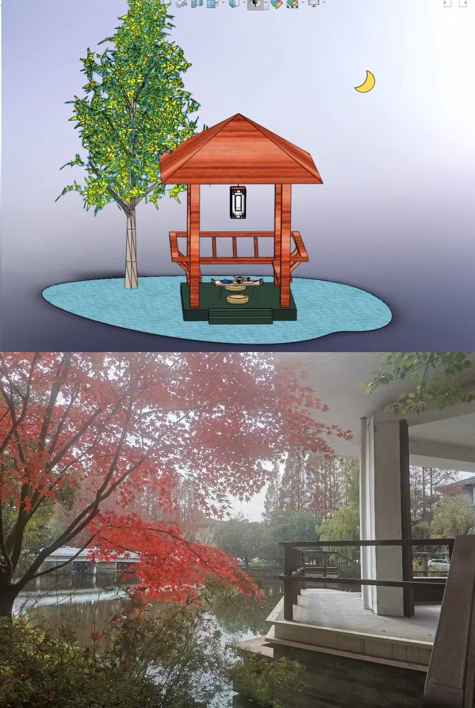

#   名称：

赏月亭（Ting.SLDASM）

#   构思想法：

鉴赏古诗词等文学作品的时候，一些场景往往只能在脑海里通过想象构建，学习了CAD以后，终于可以借助Solidworks等强大的工具让想象具像成实物了！注：树木来自素材库，仅用于效果图。

#   收获心得：

装配体拼接的时候，因为很多零件尺寸设计不当和计算误差的存在，给配合工作增加了很多困难… 亭子的屋顶也未能实现成预想的庑殿顶式，还有很多其他的细节有待完善。希望在未来的学习中不断掌握更多建模技巧！

 效果图和灵感来源——水榭观虹 

